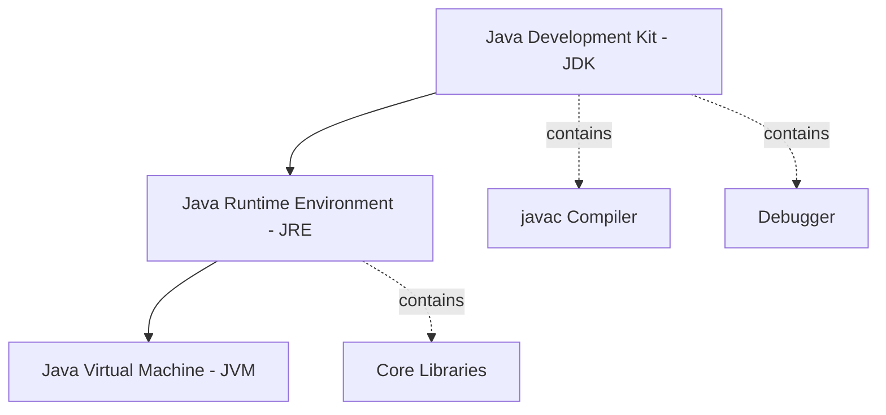

# Java Interview Questions

## Beginner-Friendly Questions 🔰

### Q1: What does "Write Once, Run Anywhere" (WORA) mean in simple terms?
**A:** `WORA` is the core promise of Java. It means a developer can write their code on one computer (like a Windows PC) and the compiled program can run on any other type of computer (like a Mac or a Linux server) without any changes.

> **Analogy:** Think of your compiled Java code (the `.class` file) as a movie on a Blu-ray disc. You can play that same disc in any brand of Blu-ray player (Sony, Panasonic, LG), and it will work perfectly. In this analogy, the Blu-ray disc is your **bytecode**, and the different players are the **Java Virtual Machines (JVMs)** installed on different operating systems.

### Q2: What is a "platform"?
**A:** A **platform** is the combination of the computer's hardware (specifically its microprocessor) and its Operating System (OS). For example, "Windows on an Intel processor" is one platform, while "macOS on an Apple Silicon processor" is another. Java's ability to run on different platforms is called **platform independence**.

### Q3: How do the Compiler, Interpreter, and JVM work together?
**A:** They work together in a two-step process to run your Java program:
1.  **Compilation:** First, the **Java Compiler** (`javac`) takes your human-readable source code (the `.java` file) and translates it into a universal, intermediate language called **bytecode**. This bytecode is saved in a `.class` file.
2.  **Execution:** Next, the **Java Virtual Machine (JVM)** on your computer starts up. The JVM contains a component that acts like an **interpreter**. This interpreter reads the bytecode line-by-line, translates it into the native machine code that your specific computer's processor can understand, and executes it.

### Q4: Why do we need a special JVM for each platform?
**A:** The JVM acts as a translator between the universal Java bytecode and the specific, native language of a platform. Since each platform (Windows/Intel, Linux/Intel, macOS/Apple) speaks a different native language, you need a specialized translator (JVM) for each one. A single JVM cannot work with many operating systems. The JVM itself is **platform-dependent** so that your Java code doesn't have to be.

### Q5: What is the relationship between the JDK, JRE, and JVM?
**A:** Think of them as nesting dolls or different levels of a toolkit:

* **JVM (Java Virtual Machine):** This is the core component, the "engine" that actually runs the Java bytecode.
* **JRE (Java Runtime Environment):** This is what you need to **run** a Java application. It includes the **JVM** plus the core libraries and other files that Java programs need to function.
* **JDK (Java Development Kit):** This is the full toolkit for developers who want to **write** Java programs. It includes everything in the **JRE**, plus the compiler (`javac`), debugger, and other development tools. The JVM is a part of the JDK.

### Q6: What is the main difference between a Java `.class` file and an `.o` (object) file from a language like C++?
> The single biggest difference is what kind of code they contain:
>
> A Java **`.class` file** contains **bytecode**, which is an intermediate-level code. This code is **platform-independent**.
>
> A C++ **`.o` file** contains **machine code**. This code is **platform-dependent**.

---

### Q7: Does Java use pointers?
> No, Java does not support pointers directly. Instead, it uses **references**, which are a safer, managed way to refer to objects in memory. This helps prevent common memory-related bugs that can occur in languages like C++.

---

### Q8: What are library files?
> **Library files** are files containing pre-written, reusable code that a programming language provides. This code is already in machine-level language and contains the bodies of built-in functions.
>
> *Analogy: 🧰 Think of them as toolboxes. Instead of building every single tool from scratch, developers can just use the ready-made tools from the language's library.*

---

### Q9: What is the difference between "Path" and "Classpath"?
> Both are environment variables, but they tell the computer where to find different things:
>
> - **Path**: An OS-level variable that tells the command line where to find **executable programs** (like `java.exe` or `javac.exe`). It's for the operating system.
>
> - **Classpath**: A Java-specific variable that tells the Java compiler and JVM where to find **Java class files** (`.class` files) and libraries (`.jar` files). It's for Java itself.

---

### Q10: What is the main disadvantage of Java?
> Its execution can be relatively **slow** when compared to languages like C and C++. This is because of the two-step process where code is first converted to bytecode, and then the JVM converts that bytecode into machine code at runtime.

---

### Q11: Is a `.class` file executable?
> **No**. A `.class` file contains bytecode, which is an intermediate language. It is not machine code. It needs the **JVM** to read, interpret, and translate it before the computer's processor can execute anything. An executable file, on the other hand, contains machine code directly and is complete.

---

### Q12: What is the job of a Class Loader?
> The **Class Loader** is a part of the JRE that is responsible for finding your `.class` files on the disk and **dynamically loading them into the computer's memory (RAM)** so the JVM can use them.
>
> *Analogy: 📖 It's like a librarian fetching a specific book (`.class` file) from the shelf (hard disk) and bringing it to your desk (RAM) so you can read it.*

---

### Q13: What is the job of the Bytecode Verifier?
> The **Bytecode Verifier** is a part of the JRE that acts like a **security guard** 👮. Before the JVM runs any bytecode, the verifier checks it to make sure it's valid and safe, and won't do anything harmful to your computer. This is especially important for running code downloaded from the internet.

---

### Q14: What is meant by "loading" and "saving" in a computer?
> These terms describe moving data between the computer's two main types of memory:
>
> - **Loading**: The process of taking a copy of data from long-term storage (like a Hard Disk) and placing it into the fast, temporary working memory (RAM).
>
> - **Saving**: The process of taking a copy of data from the working memory (RAM) and placing it back onto the long-term storage (Hard Disk).

---

### Q15: Who created Java and who owns it now?
> Java was initially created at **Sun Microsystems** by a team that included James Gosling, Mike Sheridan, and Patrick Naughton. Today, Java is owned by **[Oracle Corporation](https://www.oracle.com/java/)**.

---

### Q16: What is an "executable image"?
> An **executable image** is the "live" version of a program that is currently loaded into the computer's RAM for execution.
>
> *Analogy: 🧑‍🍳 An executable file on your disk is like a recipe in a cookbook. The executable image is when you've actually taken the recipe out, laid out the ingredients, and are actively cooking in the kitchen (RAM).*

---

### Q17: What is the difference between primary memory (RAM) and secondary memory (Hard Disk)?
> - **Primary Memory (RAM)** is the main memory. It's very **fast** but is **volatile**, meaning it loses all its data when the power is turned off. It's directly connected to the processor.
>
> - **Secondary Memory (Hard Disk)** is not directly connected to the processor. It's **slower** but is **non-volatile**, meaning it keeps data even after the power is off. It's used for long-term storage.
> 

---

### Q18: Why can't we execute an object file?
> Because an object file is **incomplete**. It often contains references to code in library files, but the actual library code has not yet been combined with it. It needs to go through a **"linking"** process to become a complete, executable file.

---

### Q19: What is linking?
> **Linking** is the process performed by a special software (like a linkage editor or linking loader) that takes one or more object files and combines them with the necessary library files. This process resolves all the external references and produces a single, complete, and executable file.

---

### Q20: Is it a good idea to send high-level source code over the internet?
> **No**, it is not recommended due to **security reasons**. Sending your source code would allow anyone to see, copy, or modify your intellectual property. It is much safer to send the compiled **bytecode (`.class` files)**, which is harder to reverse-engineer and is also platform-independent.

---
