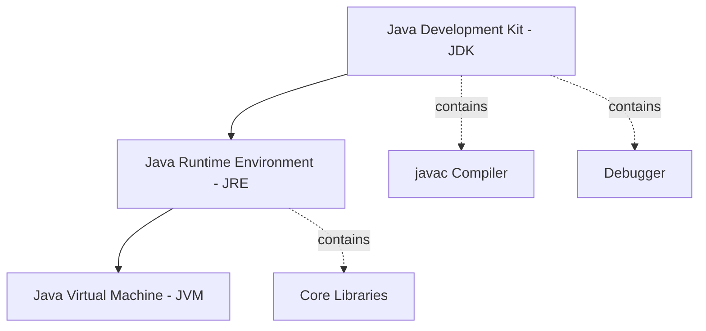

# ☕ Java Core Concepts: Interview Questions

### A comprehensive guide to Java fundamentals, from beginner to expert level. Perfect for technical interview preparation.


---

## 🧭 Table of Contents
* [Beginner-Friendly Questions 🔰](#beginner-friendly-questions-)
* [Intermediate-Level Questions 🧑‍💻](#intermediate-level-questions-)
* [Expert-Level Questions 🚀](#expert-level-questions-)
* [Contributing](#contributing)
* [License](#license)

---

## Beginner-Friendly Questions 🔰

### Q1: What does "Write Once, Run Anywhere" (WORA) mean in simple terms?
**A:** `WORA` is the core promise of Java. It means a developer can write their code on one computer (like a Windows PC) and the compiled program can run on any other type of computer (like a Mac or a Linux server) without any changes.

> **Analogy:** Think of your compiled Java code (the `.class` file) as a movie on a Blu-ray disc. You can play that same disc in any brand of Blu-ray player (Sony, Panasonic, LG), and it will work perfectly. In this analogy, the Blu-ray disc is your **bytecode**, and the different players are the **Java Virtual Machines (JVMs)** installed on different operating systems.

### Q2: What is a "platform"?
**A:** A **platform** is the combination of the computer's hardware (specifically its microprocessor) and its Operating System (OS). For example, "Windows on an Intel processor" is one platform, while "macOS on an Apple Silicon processor" is another. Java's ability to run on different platforms is called **platform independence**.

### Q3: How do the Compiler, Interpreter, and JVM work together?
**A:** They work together in a two-step process to run your Java program:
1.  **Compilation:** First, the **Java Compiler** (`javac`) takes your human-readable source code (the `.java` file) and translates it into a universal, intermediate language called **bytecode**. This bytecode is saved in a `.class` file.
2.  **Execution:** Next, the **Java Virtual Machine (JVM)** on your computer starts up. The JVM contains a component that acts like an **interpreter**. This interpreter reads the bytecode line-by-line, translates it into the native machine code that your specific computer's processor can understand, and executes it.

### Q4: Why do we need a special JVM for each platform?
**A:** The JVM acts as a translator between the universal Java bytecode and the specific, native language of a platform. Since each platform (Windows/Intel, Linux/Intel, macOS/Apple) speaks a different native language, you need a specialized translator (JVM) for each one. A single JVM cannot work with many operating systems. The JVM itself is **platform-dependent** so that your Java code doesn't have to be.

### Q5: What is the relationship between the JDK, JRE, and JVM?
**A:** Think of them as nesting dolls or different levels of a toolkit:

* **JVM (Java Virtual Machine):** This is the core component, the "engine" that actually runs the Java bytecode.
* **JRE (Java Runtime Environment):** This is what you need to **run** a Java application. It includes the **JVM** plus the core libraries and other files that Java programs need to function.
* **JDK (Java Development Kit):** This is the full toolkit for developers who want to **write** Java programs. It includes everything in the **JRE**, plus the compiler (`javac`), debugger, and other development tools. The JVM is a part of the JDK.



### Q6: What is the main difference between a Java `.class` file and an `.o` (object) file from a language like C++?
> The single biggest difference is what kind of code they contain:
>
> A Java **`.class` file** contains **bytecode**, which is an intermediate-level code. This code is **platform-independent**.
>
> A C++ **`.o` file** contains **machine code**. This code is **platform-dependent**.

---

### Q7: Does Java use pointers?
> No, Java does not support pointers directly. Instead, it uses **references**, which are a safer, managed way to refer to objects in memory. This helps prevent common memory-related bugs that can occur in languages like C++.

---

### Q8: What are library files?
> **Library files** are files containing pre-written, reusable code that a programming language provides. This code is already in machine-level language and contains the bodies of built-in functions.
>
> *Analogy: 🧰 Think of them as toolboxes. Instead of building every single tool from scratch, developers can just use the ready-made tools from the language's library.*

---

### Q9: What is the difference between "Path" and "Classpath"?
> Both are environment variables, but they tell the computer where to find different things:
>
> - **Path**: An OS-level variable that tells the command line where to find **executable programs** (like `java.exe` or `javac.exe`). It's for the operating system.
>
> - **Classpath**: A Java-specific variable that tells the Java compiler and JVM where to find **Java class files** (`.class` files) and libraries (`.jar` files). It's for Java itself.

---

### Q10: What is the main disadvantage of Java?
> Its execution can be relatively **slow** when compared to languages like C and C++. This is because of the two-step process where code is first converted to bytecode, and then the JVM converts that bytecode into machine code at runtime.

---

### Q11: Is a `.class` file executable?
> **No**. A `.class` file contains bytecode, which is an intermediate language. It is not machine code. It needs the **JVM** to read, interpret, and translate it before the computer's processor can execute anything. An executable file, on the other hand, contains machine code directly and is complete.

---

### Q12: What is the job of a Class Loader?
> The **Class Loader** is a part of the JRE that is responsible for finding your `.class` files on the disk and **dynamically loading them into the computer's memory (RAM)** so the JVM can use them.
>
> *Analogy: 📖 It's like a librarian fetching a specific book (`.class` file) from the shelf (hard disk) and bringing it to your desk (RAM) so you can read it.*

---

### Q13: What is the job of the Bytecode Verifier?
> The **Bytecode Verifier** is a part of the JRE that acts like a **security guard** 👮. Before the JVM runs any bytecode, the verifier checks it to make sure it's valid and safe, and won't do anything harmful to your computer. This is especially important for running code downloaded from the internet.

---

### Q14: What is meant by "loading" and "saving" in a computer?
> These terms describe moving data between the computer's two main types of memory:
>
> - **Loading**: The process of taking a copy of data from long-term storage (like a Hard Disk) and placing it into the fast, temporary working memory (RAM).
>
> - **Saving**: The process of taking a copy of data from the working memory (RAM) and placing it back onto the long-term storage (Hard Disk).

---

### Q15: Who created Java and who owns it now?
> Java was initially created at **Sun Microsystems** by a team that included James Gosling, Mike Sheridan, and Patrick Naughton. Today, Java is owned by **[Oracle Corporation](https://www.oracle.com/java/)**.

---

### Q16: What is an "executable image"?
> An **executable image** is the "live" version of a program that is currently loaded into the computer's RAM for execution.
>
> *Analogy: 🧑‍🍳 An executable file on your disk is like a recipe in a cookbook. The executable image is when you've actually taken the recipe out, laid out the ingredients, and are actively cooking in the kitchen (RAM).*

---

### Q17: What is the difference between primary memory (RAM) and secondary memory (Hard Disk)?
> - **Primary Memory (RAM)** is the main memory. It's very **fast** but is **volatile**, meaning it loses all its data when the power is turned off. It's directly connected to the processor.
>
> - **Secondary Memory (Hard Disk)** is not directly connected to the processor. It's **slower** but is **non-volatile**, meaning it keeps data even after the power is off. It's used for long-term storage.
> 

---

### Q18: Why can't we execute an object file?
> Because an object file is **incomplete**. It often contains references to code in library files, but the actual library code has not yet been combined with it. It needs to go through a **"linking"** process to become a complete, executable file.

---

### Q19: What is linking?
> **Linking** is the process performed by a special software (like a linkage editor or linking loader) that takes one or more object files and combines them with the necessary library files. This process resolves all the external references and produces a single, complete, and executable file.

---

### Q20: Is it a good idea to send high-level source code over the internet?
> **No**, it is not recommended due to **security reasons**. Sending your source code would allow anyone to see, copy, or modify your intellectual property. It is much safer to send the compiled **bytecode (`.class` files)**, which is harder to reverse-engineer and is also platform-independent.

---

## Intermediate-Level Questions 🧑‍💻

### Q1: How does Java's two-step execution model achieve both portability and security?
> It achieves both through the use of **bytecode**:
>
> - **Portability**: The compiler produces universal bytecode that is not specific to any machine. This single artifact can be sent to any device with a compatible JVM, which then handles the final translation to native code. This is the **"Write Once, Run Anywhere"** principle.
>
> - **Security**: Before the JVM interprets or compiles the bytecode, it is first handed to the **Bytecode Verifier**. This "security guard" analyzes the bytecode to ensure it doesn't perform illegal operations like accessing private memory or violating type rules. This verification step provides a strong security sandbox, which is difficult to implement in languages that compile directly to machine code.

### Q2: Explain the difference between a `StackOverflowError` and an `OutOfMemoryError`.
> Both are critical errors related to memory, but they happen in different parts of the JVM's memory:
>
> - **`StackOverflowError`**: This occurs in the **Stack Memory**. Each thread has its own stack, which stores information about method calls. If a method calls itself recursively without a proper exit condition, it fills up the stack with new frames until it runs out of space, causing this error.
>
> - **`OutOfMemoryError`**: This occurs in the **Heap Memory**. The heap is where all Java objects are stored. This error happens when the application tries to create a new object, but there isn't enough space left in the heap, and the Garbage Collector cannot free up any more.
>
> ```mermaid
> graph LR
>     A[Memory Error] --> B[StackOverflowError];
>     A --> C[OutOfMemoryError];
>     B --> D[Stack Memory];
>     C --> E[Heap Memory];
>     D --> F[Recursive method calls];
>     E --> G[Excessive object creation];
> ```

### Q3: Why are Strings immutable in Java? Discuss one benefit.
> A `String` object is **immutable**, meaning once it is created, its value cannot be changed. Any operation that appears to modify a `String` (like concatenation) actually creates a new `String` object.
>
> One key benefit is **security**. Many parts of a Java application rely on `String` values for parameters, such as file paths, network connections, and security credentials. If Strings were mutable, a malicious piece of code could change the value of a `String` after it has been checked for security, potentially redirecting a file operation or database query to an unauthorized target. Immutability prevents this entire class of vulnerabilities.

### Q4: What is garbage collection and why is it necessary in Java?
> **Garbage Collection (GC)** is the process by which the JVM **automatically reclaims memory** occupied by objects that are no longer in use by the application. It's necessary because it frees developers from the burden of manual memory management. In languages like C++, developers must explicitly allocate and deallocate memory. Forgetting to deallocate memory leads to **"memory leaks,"** where the application's memory usage grows indefinitely until it crashes. Java's automatic GC prevents most memory leaks and makes programs safer and easier to write.

### Q5: Explain the difference between method overloading and method overriding.
> Both are forms of polymorphism, but they are fundamentally different:
>
> - **Method Overloading (Compile-time Polymorphism)**: This is when two or more methods within the **same class** share the same name but have **different parameter lists** (either a different number of parameters or different types). The correct method to call is determined by the compiler based on the arguments passed.
>
> - **Method Overriding (Runtime Polymorphism)**: This is when a method in a **subclass** has the **same name, return type, and parameters** as a method in its superclass. The subclass provides a specific implementation for the method. The correct method to call is determined at runtime based on the actual object type.

### Q6: What is the difference between an interface and an abstract class?
> - **Abstract Class**: Can have both abstract methods (without a body) and concrete methods (with a body). A class can only **extend one abstract class**. It represents an **"is-a" relationship** with a focus on shared implementation.
>
> - **Interface**: Traditionally could only have abstract methods (Java 8+ allows default and static methods). A class can **implement multiple interfaces**. It represents a **"can-do" relationship**, defining a contract of capabilities without dictating implementation.
>
> You would choose an abstract class when you want to provide a base implementation that subclasses can share, and an interface when you want to define a contract that unrelated classes can adopt.

### Q7: What is the purpose of the `static` keyword?
> The `static` keyword means a variable or method belongs to the **class itself**, not to any specific instance (object) of that class.
>
> - **`static` Variable**: There is only **one copy** of this variable, shared among all objects of the class.
>
> - **`static` Method**: Can be called directly on the class name **without creating an object**. It cannot use non-static (instance) variables or methods because it isn't associated with a specific object.

### Q8: How does the Just-In-Time (JIT) compiler improve performance?
> A Java program starts by having the JVM interpret the bytecode, which is relatively slow. The **JIT compiler** monitors the code as it runs to identify **"hotspots"**—methods that are executed frequently. It then takes these hotspots and compiles them into highly optimized **native machine code**. The next time that method is called, the JVM executes the fast, compiled version directly instead of interpreting it again. This gives Java performance that can approach that of natively compiled languages like C++.

### Q9: What is the difference between an object file and an executable file?
> In a language like C:
>
> - **Object File (`.o`)**: This is the output of the compiler for a single source file. It contains machine code but is **incomplete**. It may have unresolved references to functions or variables defined in other files or libraries. It is **not executable**.
>
> - **Executable File**: This is the output of the **linker**. The linker takes one or more object files, combines them with the necessary code from libraries, resolves all references, and produces a **complete, standalone program** that the OS can run.

### Q10: Why is the `main` method in Java declared as `public static void`?
> - **`public`**: So it can be accessed by the JVM to start the program. If it were `private`, the JVM couldn't call it.
> - **`static`**: So the JVM can call it without having to create an object of the class first. The `main` method is the entry point, before any objects have been created.
> - **`void`**: Because it does not return any value to the JVM. Its purpose is to start the execution.

---

## Expert-Level Questions 🚀

### Q1: Explain the role of the JIT Compiler and Adaptive Optimization within the HotSpot JVM. How does this challenge the simple "interpreter" label for the JVM?
> Labeling a modern JVM like HotSpot as a simple "interpreter" is a significant oversimplification. The execution model is a highly dynamic, multi-tiered process:
>
> 1.  **Interpretation**: The JVM starts by interpreting the bytecode, while profiling the code to gather data on method call frequencies and branch execution paths.
> 2.  **JIT Compilation**: This profiling data identifies **"hotspots"**—frequently executed methods. The Just-In-Time (JIT) compiler then compiles these hotspots into highly optimized native machine code. Subsequent calls to this code will execute the fast, compiled version directly, bypassing the interpreter entirely.
> 3.  **Adaptive Optimization**: The JVM's optimization is adaptive. It can perform speculative optimizations like method inlining and escape analysis. If these assumptions later prove false, the JVM can perform **"deoptimization,"** reverting the method back to interpreted mode and potentially re-compiling it later with new profiling data.

### Q2: What is the purpose of the constant pool in a .class file, and how does it facilitate dynamic linking at runtime?
> The **constant pool** is a table within the `.class` file that acts as a symbol table. It contains all literals (strings, integers), class names, method names, and field names referenced by the bytecode.
>
> Its role in **dynamic linking** is critical. The bytecode itself does not contain hardcoded memory addresses. Instead, it contains **symbolic references** in the form of indices into the constant pool. When the JVM executes an instruction (like `invokevirtual`), it does the following at runtime:
>
> 1.  Uses the index from the bytecode to look up the symbolic reference in the constant pool.
> 2.  Resolves this symbolic reference into an actual memory address or direct pointer to the method/field.
> 3.  Executes the operation using this resolved address.
>
> This process, known as **late binding**, allows Java code to be linked on the fly.

### Q3: Explain the Java ClassLoader hierarchy and the principle of delegation. What security implications does this model have?
> Java uses a hierarchical ClassLoader model, typically consisting of three levels:
>
> 1.  **Bootstrap ClassLoader**: The parent of all loaders, it loads core Java libraries from the `<JAVA_HOME>/jre/lib` directory.
> 2.  **Extension ClassLoader** (Platform ClassLoader in Java 9+): Delegates to the Bootstrap loader, loading classes from the extensions directory.
> 3.  **System/Application ClassLoader**: The final child, it delegates to the Extension loader and loads classes from the application's classpath.
>
> The **Delegation Principle** is key: When asked to load a class, a ClassLoader first delegates the request to its **parent**. It only attempts to load the class itself if the parent cannot find it.
>
> **Security Implication**: This model is crucial for Java's security sandbox. It **prevents malicious code from replacing core Java classes**. For example, if code from the classpath tries to load a malicious `java.lang.String`, the Application ClassLoader will delegate up. The Bootstrap ClassLoader will find and load the trusted, core `java.lang.String` first, and its version will be used, neutralizing the threat.

### Q4: What problems does the Java Memory Model (JMM) solve, and how do keywords like `volatile` and the happens-before relationship provide guarantees in a multi-threaded context?
> The **JMM** solves critical problems of **visibility** and **ordering** that arise in multi-core systems due to compiler reordering and per-core CPU caches.
>
> - **The Problem**: Without a JMM, a write to a variable by one thread might never become visible to another thread, or operations could appear to happen in a different order than specified in the source code.
>
> - **Guarantees**:
>   - **`volatile`**: This keyword provides a **visibility guarantee**. When a thread writes to a `volatile` variable, the JMM ensures that this write is flushed to main memory immediately. When a thread reads a `volatile` variable, it invalidates its local cache and reads directly from main memory.
>   - **happens-before Relationship**: This is the core of the JMM's **ordering guarantee**. It defines a partial ordering of all actions in a program. If action A *happens-before* action B, then the results of A are guaranteed to be visible to and ordered before B. Things like unlocking a monitor *happens-before* any subsequent lock on that same monitor.

### Q5: Explain the mechanism of type erasure in Java generics and how "super type tokens" work around its limitations.
> **Type Erasure** is the process by which the Java compiler **removes generic type information** during compilation.
>
> - **Mechanism**: The compiler replaces a generic type parameter (e.g., `<T>`) with its bound, which is `Object` if unbounded. It then inserts the necessary type casts at call sites to maintain type safety. For example, `List<String>` becomes just `List` at runtime, and a call to `list.get(0)` will have a cast to `String` inserted by the compiler.
>
> - **Limitations**: The primary drawback is the loss of type information at runtime. You cannot do `new T()`, `T.class`, or `instanceof T`. This makes reflection on generic types very difficult.
>
> - **Super Type Tokens Workaround**: This is a pattern to capture and preserve generic type information at runtime. It works by creating an anonymous subclass of a generic type. For example: `new TypeToken<List<String>>() {}`. The generic type `List<String>` becomes part of the subclass's signature, which is not erased. At runtime, you can use reflection on this anonymous subclass to retrieve the `ParameterizedType` and extract the actual type arguments (`String` in this case).

---

## Contributing
Feel free to contribute by submitting pull requests or opening issues for suggestions and corrections.

## License
This project is open source and available under the [MIT License](https://opensource.org/licenses/MIT).

---

### Happy Learning! 🎉
